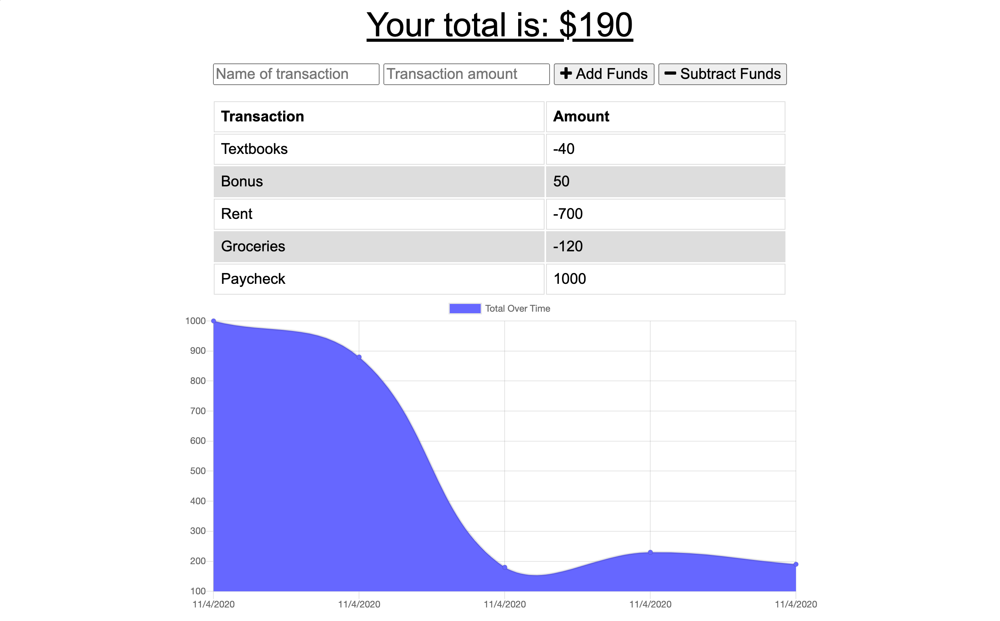

# Homework 18: Budget Tracker (PWAs)

## Description
This website application allows a user to track their earnings and expenses by inputting them into a NoSQL database where they are then displayed graphically. This is a Progressive Web App (PWA), so even if the user adds to the database without an internet connection, it will be added later when the connection returns.

## Deployed Application (Heroku)
<a href="https://calm-crag-09573.herokuapp.com/" target="_blank">Budget Tracker</a>

## Credits
* HTML
* CSS
* Javascript
* Node.js
* Express
* Compression
* MongoDB
* Mongoose
* Morgan
* Bootstrap
* Chart.js
* Heroku
* MongoDB Atlas
* lite-server

## Portfolio
<a href="https://kdoh52.github.io/" target="_blank">Updated portfolio</a>

## Contact
* kdoh52@gmail.com
